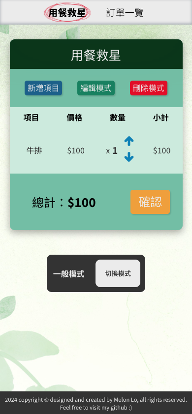

# 用餐救星

## 介紹

每次和親朋好友外出用餐時，總是為了算錢頭痛嗎？不用怕，為了算數不太靈光的你，用餐救星來了！只要使用這個APP，再也不用害怕結帳時被朋友坑錢！

## 使用方法

### 主頁（用餐救星）
1. 在主頁中，你可以查看目前訂單的狀況以及總價。（預設：$100 牛排 x 1）
2. 新增項目：點擊「新增項目」，並輸入項目名稱和價格。
3. 編輯模式：可以修改某個項目。點擊「編輯模式」，再點擊欲修改項目右側的筆，便可修改該項目的名稱或價格。
4. 刪除模式：可以刪除某個項目。點擊「刪除模式」，再點擊預刪除項目右側的 X ，便可刪除該項目。
5. 確認訂單後，點擊「確認」，可將當前的訂單送出。訂單內容可至「訂單一覽」頁面查看。

### 訂單一覽
1. 在訂單一覽中，可查看所有曾經送出過的訂單。順序由上到下，最下面的最新。
2. 重新整理可以清除所有訂單。

### 伺服器模式
1. 把此專案 clone 下來後，在終端機輸入 `npm run dev-server` 便可啟動後端伺服器（port: 3001）。
2. 點擊主頁下方的「切換模式」可切換成伺服器模式。
3. 在伺服器模式中，新增、修改、刪除等動作都會修改到後端的資料。

## 開發工具
* Node.js v21.2.0
* npm v10.2.3
* React v18.2.0

# Mealtime Saver

## Introduction
Do you always find it troublesome to split the bill when dining out with friends and family? Fear no more! For those who struggle with mental arithmetic, the Meal Savior is here! With this app, you no longer need to worry about being cheated out of money when it's time to settle the bill with friends!

## How to Use
### Main Page (Mealtime Saver)
1. On the main page, you can view the current status of the order and the total price. (Default: $100 Steak x 1)
2. Add Item: Click "Add Item" and enter the item name and price.
3. Edit Mode: You can modify a specific item. Click "Edit Mode" and then click the pen icon next to the item you want to modify to change its name or price.
4. Delete Mode: You can delete a specific item. Click "Delete Mode" and then click the X icon next to the item you want to delete.
5. After confirming the order, click "Confirm" to submit the current order. You can view the order details on the "Order Overview" page.

### Order Overview
1. In the order overview, you can view all the orders that have been submitted. The newest orders appear at the top, with older orders below.
2. Refreshing the page will clear all orders.

### Server Mode
1. After cloning this project, type `npm run dev-server` in the terminal to start the backend server (port: 3001).
2. Click "Switch Mode" at the bottom of the main page to switch to server mode.
3. In server mode, actions such as adding, editing, and deleting will modify the data on the backend.

## Development Tools
* Node.js v21.2.0
* npm v10.2.3
* React v18.2.0